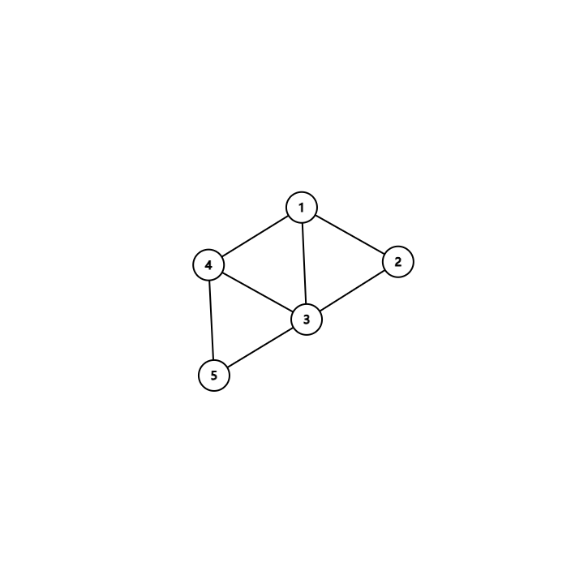
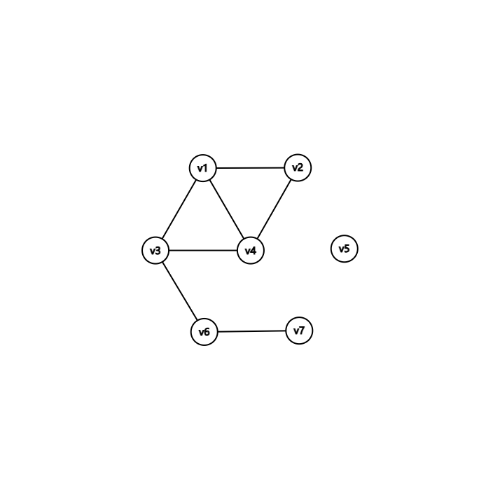
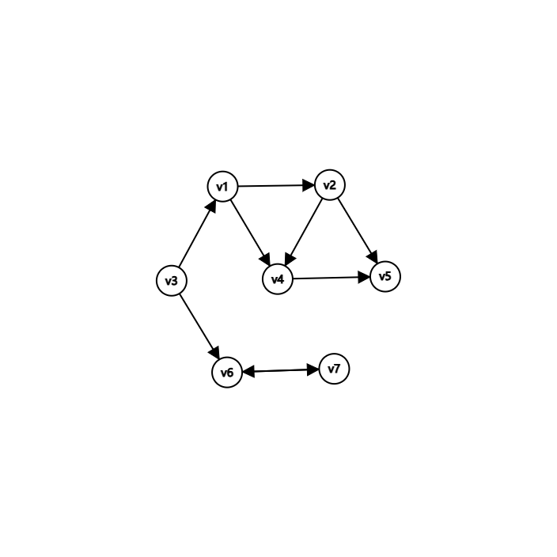
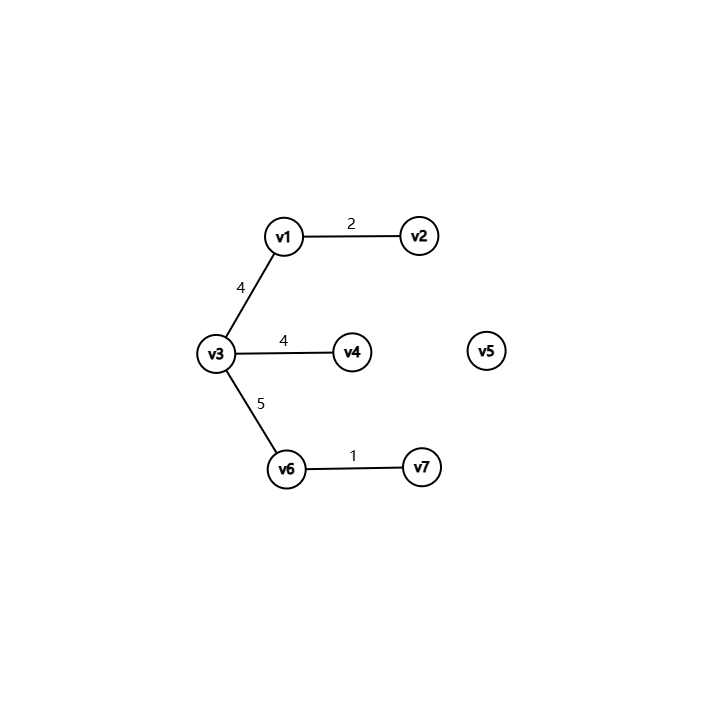

# 图论笔记
## 一. 定义
一个图 是一对

- 一个有限的**节点集** (nodes)
- **边集** (edges)

**e.g.**
表示一个图 ~~(哎哟喂这个图怎么占则么多位置啊)~~
<dir align="center">
    
</dir>
<dir align="center">
    
</dir>

---

连接两节点的边

的邻结点用表示
<dir align="center">
    
</dir>

其中中的任何节点都与相邻

---
**节点的度** 等于 邻节点连接的**边数** 不一定等于 **邻节点的数量**

因为两节点之间可能**不止存在一条边**

---
## 二. 一些常见的图
### 1. 无向无权图
<dir align="center">
    
</dir>

#### 邻接表表示

|  Vertex  | Neighbors |
|----------|-----------|
| 1        | 2, 3, 4   |
| 2        | 1, 4      |
| 3        | 1, 4, 6   |
| 4        | 1, 2, 3   |
| 5        | empty     |
| 6        | 3, 7      |
| 7        | 7, 6      |

#### 邻接矩阵表示

|    | v1 | v2 | v3 | v4 | v5 | v6 | v7 |
|----|----|----|----|----|----|----|----|
| v1 | 0  | 1  | 1  | 1  | 0  | 0  | 0  |
| v2 | 1  | 0  | 0  | 1  | 0  | 0  | 0  |
| v3 | 1  | 0  | 0  | 1  | 0  | 1  | 0  |
| v4 | 1  | 1  | 1  | 0  | 0  | 0  | 0  |
| v5 | 0  | 0  | 0  | 0  | 0  | 0  | 0  |
| v6 | 0  | 0  | 1  | 0  | 0  | 0  | 1  |
| v7 | 0  | 0  | 0  | 0  | 0  | 1  | 0  |

### 2. 有向无权图
<dir align="center">
    
</dir>

#### 邻接表表示
|  Vertex  | Neighbors |
|----------|-----------|
| 1        | 2, 4      |
| 2        | 4, 5      |
| 3        | 1, 6      |
| 4        | 5         |
| 5        | empty     |
| 6        | 7         |
| 7        | 6         |

#### 邻接矩阵表示
|    | v1 | v2 | v3 | v4 | v5 | v6 | v7 |
|----|----|----|----|----|----|----|----|
| v1 | 0  | 1  | 0  | 1  | 0  | 0  | 0  |
| v2 | 0  | 0  | 0  | 1  | 1  | 0  | 0  |
| v3 | 1  | 0  | 0  | 0  | 0  | 1  | 0  |
| v4 | 0  | 0  | 0  | 0  | 1  | 0  | 0  |
| v5 | 0  | 0  | 0  | 0  | 0  | 0  | 0  |
| v6 | 0  | 0  | 0  | 0  | 0  | 0  | 1  |
| v7 | 0  | 0  | 0  | 0  | 0  | 1  | 0  |

#### 3. 无向有权图
<dir align="center">
    
</dir>

#### 邻接矩阵表示
|    | v1 | v2 | v3 | v4 | v5 | v6 | v7 |
|----|----|----|----|----|----|----|----|
| v1 | 0  | 2  | 4  | 1  | 0  | 0  | 0  |
| v2 | 2  | 0  | 0  | 3  | 0  | 0  | 0  |
| v3 | 4  | 0  | 0  | 4  | 0  | 5  | 0  |
| v4 | 1  | 3  | 4  | 0  | 0  | 0  | 0  |
| v5 | 0  | 0  | 0  | 0  | 0  | 0  | 0  |
| v6 | 0  | 0  | 5  | 0  | 0  | 0  | 1  |
| v7 | 0  | 0  | 0  | 0  | 0  | 1  | 0  |

#### 4. 有向有权图（略）
---
### 补充
#### 权重的物理意义
示例：
每个节点是一个城镇，每个边是连接城镇的公路

- 当权重代表距离的时候，不存在的边用 ∞ 来表示
- 当权重代表公路宽度的时候，不存在的边用 0 表示

根据不同的实际情景，权重有不同的含义